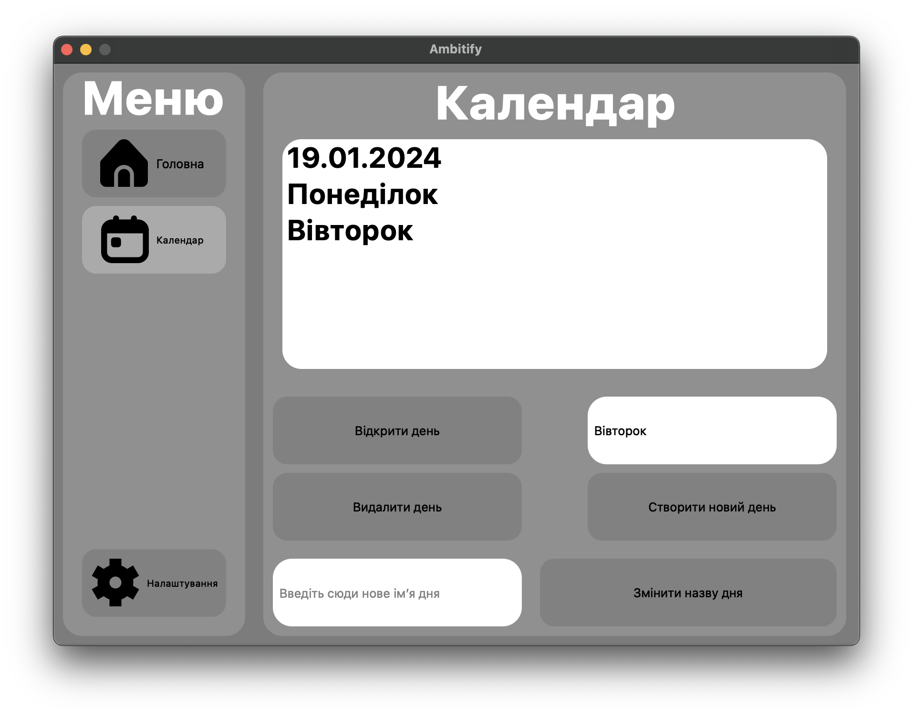
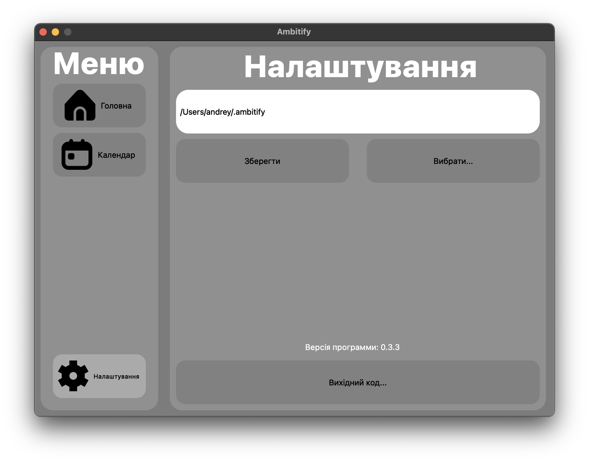

# Ambitify
Ambitify це безкоштовний та open-source планер, який не має реклами та не слідкує за користувачем. Ви можете створити свій планер на основі цього коду, або додати у планер необхідні функції

# Функції
- Зміненя шляху до бази данних
- Створення днів
- Додавання справ у день
- Регадування справ у дні
- Видалення справ у дні
- Видалення днів
- Зміненя назви днів

# Демонстрація ПЗ

Можна розтягувати вікно перегляду дня

# Структура проекту

